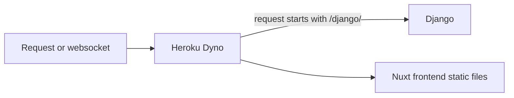

# heroku

> ### TLDR:
> Nuxt frontend paths are normal, but the API is served from `/django`,
so all api requests must be prefixed with `/django/`!

## Overview

We're setting up a reverse proxy for routing requests to either Django or static
frontend files, a database, a cache/job queue, and our dependencies
for building our app on Heroku.

When Heroku receives a request it is routed to one of our Dynos, that dyno has
to take the request and do something with it. If it's a static file, serve it.
If it's a Django request, it has to be routed to Django.

MermaidJS diagram of a request coming to Heroku, which is
routed to our dyno and then to either Django or static files.
Label the graph where the request goes to Django and say
prefixed with `/django/`

## Set up

1. Make an app on Heroku
1. Add-ons to install:
   * Postgres
   * Redis
   * Papertrail/some logger
1. In "Deploy" tab: Connect with GitHub
1. In "Settings" tab:
   * Add these buildpacks to your app:
       * heroku/nodejs
       * heroku/python
       * https://github.com/heroku/heroku-buildpack-nginx.git
   * Add env vars:
       * `SITE_DOMAIN=https://<your app>.herokuapp.com`
       * `API_BASE_URL=https://<your app>.herokuapp.com/django/api`
       * `DJANGO_SETTINGS_MODULE=settings.heroku`
       * `SECRET_KEY=<random secret key>`
1. Click "Deploy app"
1. Typically now you should run `./manage.py generate_data`

## If you want to tweak `nginx.conf`

Edit `<project root>/config/nginx.conf.erb`

## Bonus craftsman engineer style stuff

Setup [Heroku CLI](https://devcenter.heroku.com/articles/heroku-cli) on your machine.
